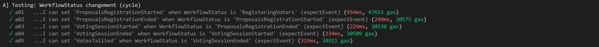
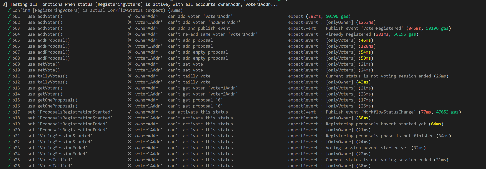
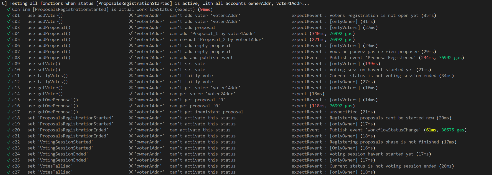
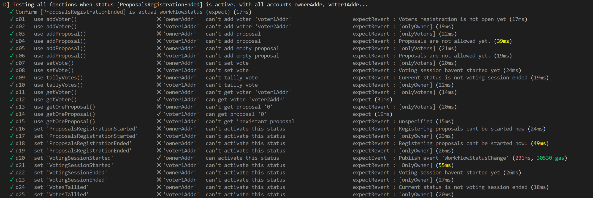
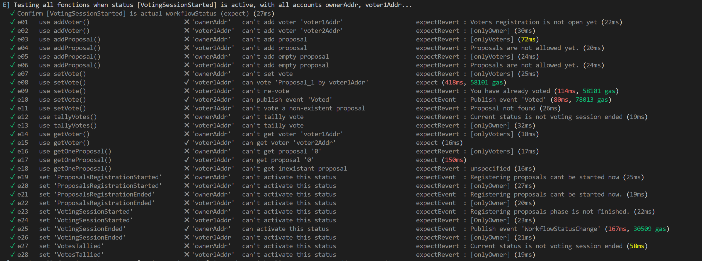
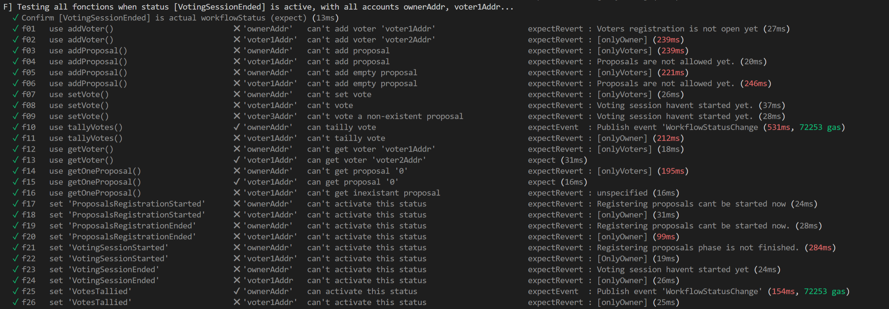
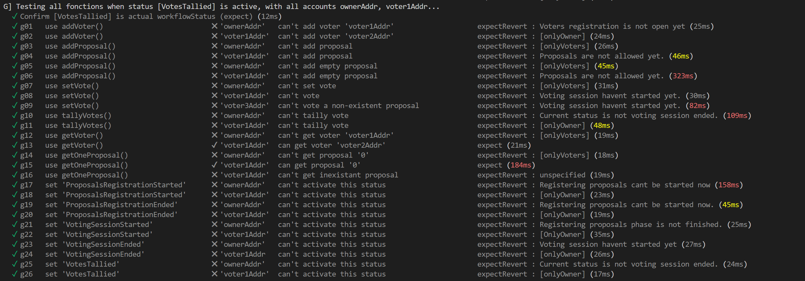
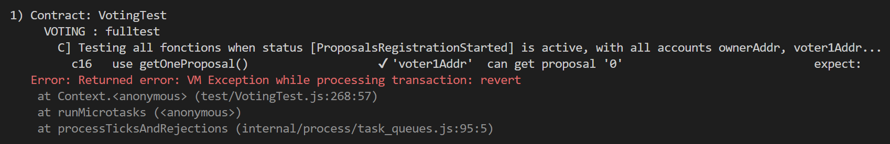
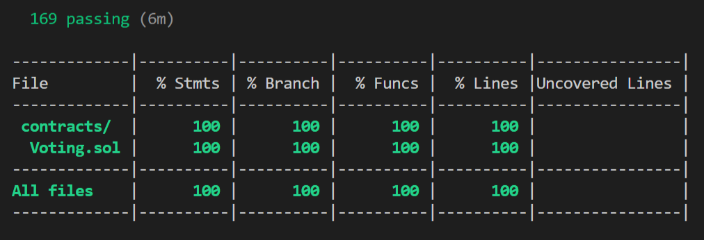
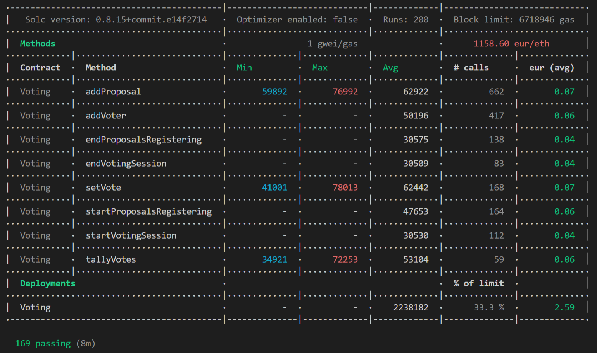

[]

# Smart Contract : Voting.sol
## _Realisation du test unitaire du contrat_

<br/>

## **1. Fonctions à tester**
Le but est de tester l'ensemble des fonctionnalitées du smart contrat, soient les fonctions :
- getVoter() : fonction qui permet de récupérer les informations d'un _voter_ à partir de son _address_
- getOneProposal()
- adVoter()
- addProposal()
- setVote()
- startProposalsRegistering()
- endProposalsRegistering()
- startVotingSession()
- endVotingSession()
- tallyVotes()

<br/><br/>

## **2. Etats à tester**
Il a été choisi de tester les fonctions précédentes selon tous les différents états du vote (_WorkflowStatus_) possible, soient les statuts :
- RegisteringVoters
- ProposalsRegistrationStarted
- ProposalsRegistrationEnded
- VotingSessionStarted
- VotingSessionEnded
- VotesTallied

<br/>

> Le choix de tester toutes les fonctions du contrart selon tous les états WorkflowStatus bien que hyper répétitif est volontaire.
> 
> Pour plus de claireté de lecture aucune factorisation du code n'a été faite.
> 
> Pour le debugage, chaque test `it()` comporte un n° d'identification afin de s'y retrouver plus rapidement.

<br/><br/>

## **3. Installation de l'environnement de test**

Les testes unitaires se feront sur un environnement local disposant de :

| | Description | Version |
| ------ | ------ | ------ |
| [Ganache](https://trufflesuite.com/ganache/index.html) | est une blockchain ETH locale | ^5.4.29 |
| [Truffle](https://) | est un environnement de développement | ^0 |
| [NodeJS](https://) | est un environnement d'exécution | ^0 |

<br/>

### 3.1. Installations de l'environnement
Depuis notre dossier $dev nous allons créer un sous-dossier de travail :
```sh
$ mkdir votingtest
$ cd votingtest
```
C'est à partir de ce dossier que nous installerons l'ensemble des outils nécesaires.

#### Mise à jour des packages
```sh
sudo apt-get update && sudo apt-get -y upgrade
sudo apt-get -y install curl git vim build-essential
```

#### Installation de Ganache
```sh
sudo npm install -g ganache
```

#### Installation de Truffle
```sh
npm install -g truffle
```

#### Installation de NodeJS
```sh
sudo apt-get install curl software-properties-common
curl -sL https://deb.nodesource.com/setup_10.x | sudo bash -
sudo apt-get install nodejs
```

<br/>


### 3.2. Installations des plugins supplémentaires

Pour la réalisation de ce test nous avons eu besoin d'installer plusieurs plugins/librairies supplémentaires, soient :

| | Description | Version |
| ------ | ------ | ------ |
| [MochaJS](https://mochajs.org)  | ... | ... |
| [ChaiJS](https://www.chaijs.com) | ... | ^4.3.6 |
| [BigNumber.js](https://mikemcl.github.io/bignumber.js/) | ... | ^4.5.0 |
| [Contract d'@OpenZeppelin](...) | ... | ^4.5.0 |
| [Test Helpers d'@OpenZeppelin](https://www.npmjs.com/package/@openzeppelin/test-helpers) | ... | ^0.5.15 |
| [Solidity Coverage](https://github.com/sc-forks/solidity-coverage)  | ... | ^0.7.20 |
| [Eth-gas-reporter](...)  | ... | ^0.2.24 |

<br/>

#### Installation de MochaJs
```sh
$ npm install --global mocha
```

#### Installation de ChaiJS
```sh
$ npm install chai
```

#### Installation de BigNumber
La librairie bigNumber est directement incluse lorsuqe nous faisons appel aux '_Test Helpers d'@OpenZeppelin_'

#### Installation des contract d'@OpenZeppelin
```sh
$ npm install @openzeppelin/contracts
```

#### Installation des test Helpers d'@OpenZeppelin
```sh
$ npm install @truffle/hdwallet-provider
```

#### Installation de Solidity Coverage
```sh
$ npm install --save-dev solidity-coverage
```

#### Installation de Eth-gas-reporter
```sh
$ npm install --save-dev --prefixe . eth-gas-reporter
```

<br />

### 3.3. Initialisations et paramétrages de Truffle

#### Initialisation de Truffle :
```sh
$ truffle init
```

#### Parammétrage du fichier `truffle-config.js` de Truffle
```js
module.exports = {

  networks: {
    development: {
      host: "127.0.0.1",     // Localhost (default: none)
      port: 8545,            // Standard Ethereum port (default: none)
      network_id: "*",       // Any network (default: none)
    },
  },

  plugins: ["solidity-coverage"],

  // Set default mocha options here, use special reporters, etc.
  mocha: {
    // timeout: 100000
    reporter: 'eth-gas-reporter',
      reporterOptions : {
        gasPrice:1,
        token:'ETH',
        showTimeSpent: true,
        coinmarketcap: 'be6197c7-1c94-4f24-b4c5-ec1fb6351898',
      }
  },

  // Configure your compilers
  compilers: {
    solc: {
      version: "0.8.15",      // Fetch exact version from solc-bin (default: truffle's version)
      // docker: true,        // Use "0.5.1" you've installed locally with docker (default: false)
       settings: {          // See the solidity docs for advice about optimization and evmVersion
        optimizer: {
          enabled: false,
          runs: 200
        },
      //  evmVersion: "byzantium"
       }
    }
  },

};
```

Nous utiliserons l'API de [Coinmarketcap](https://coinmarketcap.com/) pour le calcul des coûts en gas en Euro.

<br/>

### 3.4. Initialisations et paramétrages de nodeJS

#### Initialisation de nodeJS :
```sh
$ npm init
```

#### Parammétrage du fichier `package.json` de nodeJS
```js
{
  "name": "Voting",
  "version": "1.0.0",
  "main": "VotingTest.js",
  "license": "MIT",
  "dependencies": {
    "truffle": "5.4.29",
    "chai": "^4.3.6",
    "@openzeppelin/contracts": "^4.5.0",
    "@openzeppelin/test-helpers": "^0.5.15",
    "solidity-coverage": "^0.7.20",
    "eth-gas-reporter": "^0.2.24"
  },
  "scripts": {
    "migrate": "truffle migrate",
    "test": "truffle test",
    "coverage": "truffle run coverage"
  }
}
```


#### Installation des dépendances de nodeJS :
```sh
npm install
```

<br/><br/>


## **4. Ecriture du test unitaire**

ScriptJS de test unitaire : [VotingTest.js](https://github.com/bad4token/Alyra_Rendu/tree/main/Projet2_SystemDeVote_TestUnitaire/test/VotingTest.js)

<br />

### **4.1. Test groupe A :** passage des _WorkflowStatus_

Un premier test est fait pour s'assurer du bon enchainement des "_WorkflowStatus_" :

**Resultats groupe A :** 5 tests


<br />

### **4.2. Test groupe B :** status _RegisteringVoters_

Mettons le "_WorkflowStatus_" à "_RegisteringVoters_" et testons toutes les fonctions :

**Resultats groupe B :** 26 tests


<br />

### **4.2. Test groupe C :** status _ProposalsRegistrationStarted_

Mettons le "_WorkflowStatus_" à "_ProposalsRegistrationStarted_" et testons toutes les fonctions :

Paramètres préchargé dans le ``beforeEach` :
```js
beforeEach(async function () {
    // new instance
    votingInstance = await Voting.new({from:ownerAddr});
    // pre-load data
    await votingInstance.addVoter(voter1Addr, {from:ownerAddr});
    await votingInstance.addVoter(voter2Addr, {from:ownerAddr});
    await votingInstance.addVoter(voter3Addr, {from:ownerAddr});
    // active startProposalsRegistering
    await votingInstance.startProposalsRegistering({from:ownerAddr});
});
```

**Resultats groupe C :** 27 tests


<br />

### **4.3. Test groupe D :** status _ProposalsRegistrationEnded_

Mettons le "_WorkflowStatus_" à "_ProposalsRegistrationEnded_" et testons toutes les fonctions :

Paramètres préchargé dans le ``beforeEach` :
```js
beforeEach(async function () {
    // new instance
    votingInstance = await Voting.new({from:ownerAddr});
    // pre-load 'voters'
    await votingInstance.addVoter(voter1Addr, {from:ownerAddr});
    await votingInstance.addVoter(voter2Addr, {from:ownerAddr});
    await votingInstance.addVoter(voter3Addr, {from:ownerAddr});
    // active startProposalsRegistering
    await votingInstance.startProposalsRegistering({from:ownerAddr});
    // pre-load 'proposals'
    await votingInstance.addProposal("Proposal_1 by voter1Addr", {from:voter1Addr});
    await votingInstance.addProposal("Proposal_2 by voter2Addr", {from:voter2Addr});
    await votingInstance.addProposal("Proposal_22 by voter2Addr", {from:voter2Addr});
    await votingInstance.addProposal("Proposal_3 by voter3Addr", {from:voter3Addr});
    await votingInstance.addProposal("Proposal_33 by voter3Addr", {from:voter3Addr});
    await votingInstance.addProposal("Proposal_333 by voter3Addr", {from:voter3Addr});
    // active endProposalsRegistering
    await votingInstance.endProposalsRegistering({from:ownerAddr});
});
```

**Resultats groupe D :** 25 tests


<br />

### **4.4. Test groupe E :** status _VotingSessionStarted_

Mettons le "_WorkflowStatus_" à "_VotingSessionStarted_" et testons toutes les fonctions :

Paramètres préchargé dans le ``beforeEach` :
```js
beforeEach(async function () {
    // new instance
    votingInstance = await Voting.new({from:ownerAddr});
    // pre-load 'voters'
    await votingInstance.addVoter(voter1Addr, {from:ownerAddr});
    await votingInstance.addVoter(voter2Addr, {from:ownerAddr});
    await votingInstance.addVoter(voter3Addr, {from:ownerAddr});
    // active ProposalsRegistrationStarted
    await votingInstance.startProposalsRegistering({from:ownerAddr});
    // pre-load 'proposals'
    await votingInstance.addProposal("Proposal_1 by voter1Addr", {from:voter1Addr});
    await votingInstance.addProposal("Proposal_2 by voter2Addr", {from:voter2Addr});
    await votingInstance.addProposal("Proposal_22 by voter2Addr", {from:voter2Addr});
    await votingInstance.addProposal("Proposal_3 by voter3Addr", {from:voter3Addr});
    await votingInstance.addProposal("Proposal_33 by voter3Addr", {from:voter3Addr});
    await votingInstance.addProposal("Proposal_333 by voter3Addr", {from:voter3Addr});
    // active ProposalsRegistrationEnded
    await votingInstance.endProposalsRegistering({from:ownerAddr});
    // active VotingSessionStarted
    await votingInstance.startVotingSession({from:ownerAddr});
});
```

**Resultats groupe E :** 28 tests


<br />

### **4.5. Test groupe F :** status _VotingSessionEnded_

Mettons le "_WorkflowStatus_" à "_VotingSessionEnded_" et testons toutes les fonctions :

Paramètres préchargé dans le ``beforeEach` :
```js
beforeEach(async function () {
    // new instance
    votingInstance = await Voting.new({from:ownerAddr});
    // pre-load 'voters'
    await votingInstance.addVoter(voter1Addr, {from:ownerAddr});
    await votingInstance.addVoter(voter2Addr, {from:ownerAddr});
    await votingInstance.addVoter(voter3Addr, {from:ownerAddr});
    // active ProposalsRegistrationStarted
    await votingInstance.startProposalsRegistering({from:ownerAddr});
    // pre-load 'proposals'
    await votingInstance.addProposal("Proposal_1 by voter1Addr", {from:voter1Addr});
    await votingInstance.addProposal("Proposal_2 by voter2Addr", {from:voter2Addr});
    await votingInstance.addProposal("Proposal_22 by voter2Addr", {from:voter2Addr});
    await votingInstance.addProposal("Proposal_3 by voter3Addr", {from:voter3Addr});
    await votingInstance.addProposal("Proposal_33 by voter3Addr", {from:voter3Addr});
    await votingInstance.addProposal("Proposal_333 by voter3Addr", {from:voter3Addr});
    // active ProposalsRegistrationEnded
    await votingInstance.endProposalsRegistering({from:ownerAddr});
    // active VotingSessionStarted
    await votingInstance.startVotingSession({from:ownerAddr});
    // pre-load 'votes'
    await votingInstance.setVote(0, {from:voter1Addr});
    await votingInstance.setVote(1, {from:voter2Addr});
    await votingInstance.setVote(1, {from:voter3Addr});
    // active VotingSessionEnded
    await votingInstance.endVotingSession({from:ownerAddr});
});
```

**Resultats groupe F :** 26 tests


<br />

### **4.6. Test groupe G :** status _VotesTallied_

Mettons le "_WorkflowStatus_" à "_VotesTallied_" et testons toutes les fonctions :

Paramètres préchargé dans le ``beforeEach` :
```js
beforeEach(async function () {
    // new instance
    votingInstance = await Voting.new({from:ownerAddr});
    // pre-load 'voters'
    await votingInstance.addVoter(voter1Addr, {from:ownerAddr});
    await votingInstance.addVoter(voter2Addr, {from:ownerAddr});
    await votingInstance.addVoter(voter3Addr, {from:ownerAddr});
    // active ProposalsRegistrationStarted
    await votingInstance.startProposalsRegistering({from:ownerAddr});
    // pre-load 'proposals'
    await votingInstance.addProposal("Proposal_1 by voter1Addr", {from:voter1Addr});
    await votingInstance.addProposal("Proposal_2 by voter2Addr", {from:voter2Addr});
    await votingInstance.addProposal("Proposal_22 by voter2Addr", {from:voter2Addr});
    await votingInstance.addProposal("Proposal_3 by voter3Addr", {from:voter3Addr});
    await votingInstance.addProposal("Proposal_33 by voter3Addr", {from:voter3Addr});
    await votingInstance.addProposal("Proposal_333 by voter3Addr", {from:voter3Addr});
    // active ProposalsRegistrationEnded
    await votingInstance.endProposalsRegistering({from:ownerAddr});
    // active VotingSessionStarted
    await votingInstance.startVotingSession({from:ownerAddr});
    // pre-load 'votes'
    await votingInstance.setVote(0, {from:voter1Addr});
    await votingInstance.setVote(1, {from:voter2Addr});
    await votingInstance.setVote(0, {from:voter3Addr});
    // active VotingSessionEnded
    await votingInstance.endVotingSession({from:ownerAddr});
    // active VotingSessionEnded
    await votingInstance.tallyVotes({from:ownerAddr});
});
```

**Resultats groupe G :** 26 tests



<br/><br/>

## **5. Lancement du test**

### Lancement du test
```sh
$ truffle test
```

### Lancement du calcul du coverage
```sh
$ npm run coverage
```


<br/><br/>

## **6. Lecture des résultats**

Les résultats obtenus sont ceux attendu.
Cependant le test de la fonction `getOneProposal()` lors de certaine phase "_WorkflowStatus_" révèle qu'il se produit un `expectRevert : unspecified` lorsqu'une tentative d'obtenir un _`proposal`_ qui n'existe pas, hors dimension du tableau.

<br/>

Exemple d'erreur qui provoque un require lors test C16


<br/>

### 6.1. Solutions d'amélioration

Il serai utile de placer un require sur la fonction `getOneProposal()` afin de controler que l'`id` passé en paramètre est inférieur à la talle du tableau `proposalsArray`.

```sh
$ 
```

<br/>

### 6.2. Etat du coverage du test

Il y a eu `169 tests`.  
Le coverage est de `100 %`



### 6.3. Consommation de gas

La consommation pour le déploiement du contrat sur la blockchain ETH est de : 2238182 gas, soit 2.59e



<br/><br/>

## **7. Remerciements**
- [Ecole Alyra](https://alyra.fr/) - Pour la qualité de la formation dispensé. Mention spécial à Cyril ;) !
- [La famille](https://www.crushpixel.com/big-static16/preview4/big-family-gathering-table-outdoors-2341837.jpg) - si si !


<br/><br/>

## **8. License**

MIT